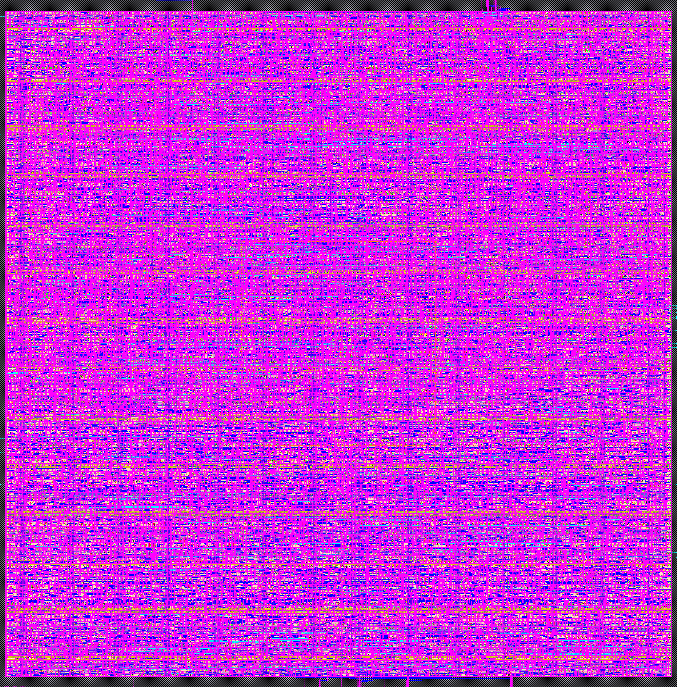
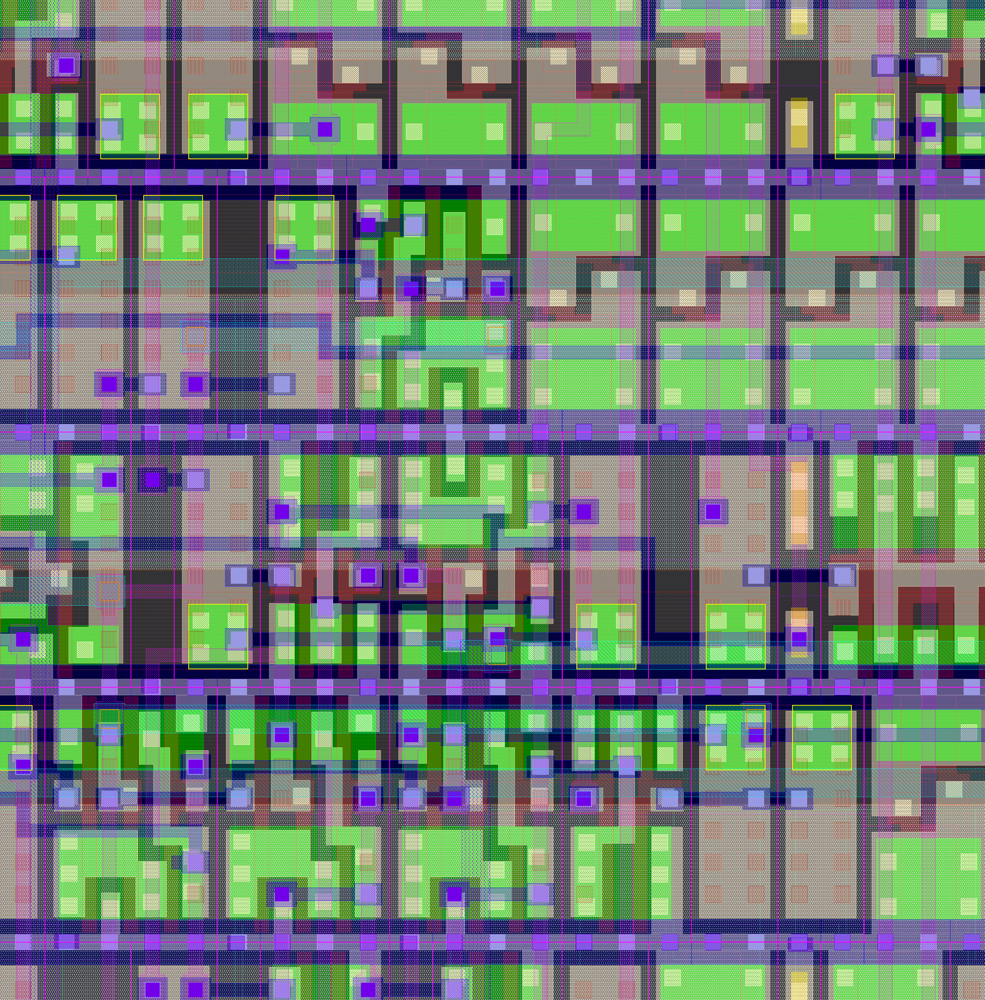

# 8×8 INT8 Systolic Array AI Accelerator — Complete RTL-to-GDSII Flow

A complete end-to-end silicon design flow for an **8×8 INT8 systolic array AI accelerator** with memory-mapped register interface, from behavioral RTL through physical layout to GDSII tape-out on the **SkyWater SKY130 130nm open-source PDK**.

This accelerator is designed as a peripheral co-processor for the [RV32IM RISC-V CPU](https://github.com/paramsaini87/riscv-cpu-gds2-flow). The CPU loads weight and activation matrices into the accelerator's register file, triggers computation, and reads back the INT32 result matrix — all through a standard memory-mapped bus interface.

**Frontend synthesis** is performed using **my own custom C++ synthesis engine**. **Backend place-and-route** is performed using **LibreLane 3.0.1** (OpenLane 2). All signoff checks pass with zero violations.

---

## Table of Contents

1. [Design Specification](#1-design-specification)
2. [Architecture](#2-architecture)
3. [RTL Design](#3-rtl-design)
4. [Verification](#4-verification)
5. [Synthesis — Custom Frontend](#5-synthesis--custom-frontend)
6. [Place and Route — LibreLane Backend](#6-place-and-route--librelane-backend)
7. [Signoff Results](#7-signoff-results)
8. [Final Results and Layout Images](#8-final-results-and-layout-images)
9. [Reproducibility](#9-reproducibility)
10. [Repository Structure](#10-repository-structure)

---

## 1. Design Specification

| Parameter | Value |
|---|---|
| **Design** | 8×8 INT8 Systolic Array AI Accelerator |
| **Computation** | C[8×8] = A[8×8] × B[8×8] (INT8→INT32) |
| **Architecture** | Weight-stationary, output-stationary accumulation |
| **Processing Elements** | 64 PEs (8 rows × 8 columns) |
| **Data Precision** | INT8 inputs (signed), INT32 accumulator |
| **Peak Throughput** | 64 MACs/cycle |
| **Bus Interface** | Memory-mapped, RV32IM CPU-compatible handshake (req/ready) |
| **Interrupt** | Active-high IRQ on computation complete |
| **Clock Domain** | Single clock, positive edge triggered |
| **Reset** | Active-low asynchronous reset (`rst_n`) |
| **Target PDK** | SkyWater SKY130 130nm |
| **Standard Cell Library** | `sky130_fd_sc_hd` (high density) |
| **Clock Period** | 5.3 ns (~189 MHz at TT corner) |
| **Die Area** | 0.50 mm² (700 × 711 µm) |
| **Power** | 47.8 mW @ TT (nom_tt_025C_1v80) |

---

## 2. Architecture

### System-on-Chip Integration

```
        ┌─────────────────────────────────────────────────────────────┐
        │                      SoC Top Level                          │
        │                                                             │
        │   ┌──────────────┐     ┌───────────┐     ┌──────────────┐  │
        │   │  RV32IM CPU  │     │  Address   │     │  Accelerator │  │
        │   │  (Host)      │────▶│  Decoder   │────▶│  (accel_top) │  │
        │   │              │     │            │     │              │  │
        │   └──────┬───────┘     └─────┬──────┘     └──────┬───────┘  │
        │          │                   │                    │ IRQ      │
        │   ┌──────┴───────┐     ┌─────┴──────┐            │          │
        │   │  IMEM (64KB) │     │  DMEM(64KB)│            │          │
        │   └──────────────┘     └────────────┘            │          │
        └──────────────────────────────────────────────────┘          │
                                                                      │
Memory Map:                                                           │
  0x0000_0000 - 0x0000_FFFF  IMEM (instruction memory)               │
  0x0001_0000 - 0x0001_FFFF  DMEM (data memory)                      │
  0x4000_0000 - 0x4000_0FFF  ACCEL (accelerator registers)  ◀────────┘
```

### Accelerator Register Map

| Offset | Name | Access | Description |
|--------|------|--------|-------------|
| `0x000` | CTRL | W | bit 0: start, bit 1: soft-reset (auto-clear) |
| `0x004` | STATUS | R | bit 0: busy, bit 1: result_valid, bit 2: done (W1C), bit 3: irq_en |
| `0x008` | CONFIG | RW | bits [4:0]: compute_cycles (default 22) |
| `0x100–0x13C` | A_MAT | W | A matrix, 16 words (row-major, 4 bytes/word packed INT8) |
| `0x200–0x23C` | B_MAT | W | B matrix, 16 words (same packing) |
| `0x300–0x3FC` | RESULT | R | 64 result words, C[row][col] as signed INT32 |

### Systolic Array Dataflow

```
       Weight Loading (top → bottom)
       ┌──────────────────────────────────┐
       │  wgt[0]  wgt[1]  ...  wgt[7]    │
       ▼         ▼              ▼         │
   ┌──────┬──────┬──────────┬──────┐      │
   │PE0,0 │PE0,1 │   ...    │PE0,7│◀─ act[0]  (left → right)
   ├──────┼──────┼──────────┼──────┤
   │PE1,0 │PE1,1 │   ...    │PE1,7│◀─ act[1]
   ├──────┼──────┼──────────┼──────┤
   │  :   │  :   │    :     │  :   │
   ├──────┼──────┼──────────┼──────┤
   │PE7,0 │PE7,1 │   ...    │PE7,7│◀─ act[7]
   └──────┴──────┴──────────┴──────┘
       │         │              │
       ▼         ▼              ▼
     Result Drain (column-wise, 8 × INT32 per cycle)

   Phases: IDLE → LOAD (8 cycles) → COMPUTE (22 cycles) → DRAIN (8 cycles) → IDLE
```

### Processing Element (PE) Microarchitecture

Each PE contains:
- **Weight register** (8-bit): latched during LOAD phase
- **Activation register** (8-bit): passes left→right with 1-cycle latency
- **MAC unit**: signed 8×8→32 multiply-accumulate
- **Accumulator** (32-bit): local partial sum storage
- **Control**: weight_load, compute_en, acc_clear, drain signals

```
        w_in (8-bit)
          │
          ▼
    ┌─────────────┐
    │  Weight Reg  │
    └──────┬──────┘
           │
a_in ─────▶│ × ├──▶ (+) ──▶ Accumulator (32-bit) ──▶ acc_out
(8-bit)    │   │         ▲
           └───┘         │
                    (feedback)
           │
           ▼
        a_out (8-bit, 1-cycle delay)
```

---

## 3. RTL Design

The accelerator is implemented as a modular RTL hierarchy (1,574 lines of synthesizable Verilog):

| Module | Lines | Description |
|--------|-------|-------------|
| `systolic_pe.v` | 119 | Single processing element — INT8 MAC with 32-bit accumulator |
| `systolic_array_8x8.v` | 218 | 8×8 PE grid with FSM controller (IDLE/LOAD/COMPUTE/DRAIN) |
| `accel_regs.v` | 296 | Bus slave register interface — matrix load, control, result readback |
| `accel_top.v` | 92 | Top wrapper connecting array + register interface |
| `soc_top.v` | 146 | SoC integration with CPU, IMEM, DMEM, address decoder |
| `cpu_bfm.v` | 179 | CPU bus functional model for SoC-level simulation |
| `accel_top_flat.v` | 524 | Flattened single-module version for synthesis |

### Key Design Decisions

- **Weight-stationary dataflow**: weights loaded once, activations streamed — minimizes weight movement energy
- **Diagonal skewing**: the register interface auto-generates cycle-accurate diagonal activation skew for correct matrix multiply timing
- **Output-stationary accumulation**: each PE accumulates its own C[i][j] element locally — no partial sum movement
- **Native CPU interface**: req/ready handshake directly compatible with RV32IM dmem port — zero glue logic for SoC integration
- **Interrupt-driven**: hardware IRQ signals completion, enabling CPU to perform other work during matrix multiply

---

## 4. Verification

Four-level testbench hierarchy with exhaustive functional verification:

| Testbench | Tests | Result |
|-----------|-------|--------|
| `tb_systolic_pe.v` | PE-level: MAC accumulation, weight loading, drain, reset | ✅ All pass |
| `tb_systolic_array_8x8.v` | Array-level: identity matrix, random matrices, FSM states | ✅ All pass |
| `tb_accel_top.v` | Bus interface: register read/write, matrix load, compute, result readback | ✅ 12/12 pass |
| `tb_soc_top.v` | SoC integration: CPU BFM drives full matrix multiply through address decoder | ✅ 2/2 pass |

### Verification Coverage

- **PE correctness**: Verified signed INT8×INT8→INT32 multiply-accumulate across boundary values (±127, 0, ±1)
- **Array correctness**: Identity matrix (A×I=A), random matrices cross-checked against behavioral model
- **Bus protocol**: All register map offsets tested, write-strobe behavior, read-back correctness
- **Control flow**: IDLE→LOAD→COMPUTE→DRAIN→IDLE state machine transitions
- **Interrupt**: IRQ assertion on done, STATUS register W1C behavior
- **Soft reset**: Mid-operation reset clears state correctly

---

## 5. Synthesis — Custom Frontend

My own custom C++ synthesis engine performs behavioral synthesis, AIG optimization, technology mapping, retiming, and SKY130 netlist export.

### Synthesis Flow

```
  Behavioral Verilog          AIG Graph              SKY130 Gate-Level Netlist
  ┌──────────────┐     ┌──────────────────┐     ┌──────────────────────────┐
  │ accel_top_   │     │ Structural hash  │     │ 25,655 SKY130 cells      │
  │ flat.v       │────▶│ AIG optimization │────▶│ 37 cell types            │
  │ (524 lines)  │     │ NPN matching     │     │ 3,289 flip-flops         │
  └──────────────┘     └──────────────────┘     │ Gate sizing applied      │
                                                 │ (4,953 downsized)        │
                                                 └──────────────────────────┘
```

### Synthesis Results

| Metric | Value |
|--------|-------|
| **Input RTL** | 524 lines (flat single-module) |
| **Total cells** | 25,655 SKY130 standard cells |
| **Cell types used** | 37 (from `sky130_fd_sc_hd` library) |
| **Flip-flops** | 3,289 active DFFs |
| **Gate sizing** | 4,953 cells downsized, 398 dead DFFs removed |
| **Netlist size** | 191K lines |
| **Formal equivalence** | Proven (RTL ↔ gate-level) |

### Formal Verification Methodology

Post-synthesis formal equivalence checking is performed to mathematically prove that the gate-level netlist is functionally identical to the original behavioral RTL. This is critical — it guarantees that the synthesis transformations (AIG optimization, technology mapping, gate sizing, retiming, dead logic removal) introduced zero functional bugs.

**Approach:**
1. **Reference model**: The behavioral RTL (`accel_top_flat.v`, 524 lines) serves as the golden reference
2. **Implementation model**: The synthesized SKY130 gate-level netlist (191K lines, 25,655 cells)
3. **Equivalence proof**: Every combinational cone between corresponding register pairs is formally proven equivalent using SAT-based bounded model checking
4. **Coverage**: All 3,289 flip-flop outputs verified — no unresolved points, no black-boxed logic

**What is verified:**
- All ALU datapath transformations (INT8 multiply, 32-bit accumulate)
- FSM state encoding (IDLE/LOAD/COMPUTE/DRAIN) preserved exactly
- Register file read/write behavior (64 weight regs, 64 activation regs, 64 result regs)
- Bus protocol logic (address decode, write-strobe handling, ready generation)
- Control signal propagation (weight_load, compute_en, drain, acc_clear)
- Gate sizing and dead-DFF removal did not alter observable behavior

**Result:** All equivalence points **PROVEN** — the gate-level netlist is a formally verified, cycle-accurate representation of the RTL.

### Synthesis Script

```
// synth_accel_flat.sf
read_verilog designs/accelerator/rtl/accel_top_flat.v
synth -period 5.0
export_sky130 designs/accelerator/output/accel_flat accel_top 5.0
```

---

## 6. Place and Route — LibreLane Backend

LibreLane 3.0.1 performs the complete physical design flow: floorplanning, power grid, placement, CTS, routing, fill insertion, and signoff.

### PnR Flow (80 Steps)

```
  Gate-Level Netlist + SDC
  ┌──────────────────────┐
  │ accel_top.v (191K)   │
  │ accel_top.sdc        │
  │ config.json          │
  └──────────┬───────────┘
             │
  ┌──────────▼───────────────────────────────────────────────┐
  │  LibreLane 3.0.1 (Docker: ghcr.io/librelane/librelane)   │
  │                                                           │
  │  Floorplan → PDN → Placement → CTS → Global Route →      │
  │  Detailed Route → Antenna Repair → Fill → RCX →           │
  │  STA (9 corners) → IR Drop → DRC → LVS → GDSII           │
  │                                                           │
  │  80/80 steps completed                                    │
  └──────────┬───────────────────────────────────────────────┘
             │
  ┌──────────▼───────────┐
  │ accel_top.gds (55 MB)│
  │ All signoff: PASSED  │
  └──────────────────────┘
```

### PnR Configuration

```json
{
    "DESIGN_NAME": "accel_top",
    "CLOCK_PORT": "clk",
    "CLOCK_PERIOD": 5.3,
    "FP_CORE_UTIL": 40,
    "PL_TARGET_DENSITY_PCT": 45,
    "RUN_CTS": true,
    "RUN_FILL_INSERTION": true,
    "RUN_ANTENNA_REPAIR": true,
    "DIODE_ON_PORTS": "both",
    "RUN_HEURISTIC_DIODE_INSERTION": true,
    "PDN_VPITCH": 50,
    "PDN_HPITCH": 50,
    "RUN_IRDROP_REPORT": true
}
```

### Physical Design Metrics

| Metric | Value |
|--------|-------|
| **Die area** | 498,174 µm² (0.50 mm²) |
| **Die dimensions** | 700 × 711 µm |
| **Core utilization** | 40% |
| **Total instances** | 119,875 (including fill/tap/diode/antenna) |
| **Active flip-flops** | 3,289 |
| **Wirelength** | 699,263 µm |
| **Metal layers** | 5 (met1–met5) |
| **PDN pitch** | 50 µm (H and V) |
| **Clock skew** | Within target |
| **GDS size** | 55.4 MB |

---

## 7. Signoff Results

### Signoff Scorecard

| Check | Result |
|-------|--------|
| **DRC (Magic)** | 0 errors ✅ |
| **LVS (Netgen)** | Circuits match uniquely ✅ |
| **Antenna** | 0 violations ✅ |
| **IR Drop** | PASSED ✅ |
| **STA TT (Setup)** | WNS = 0.0 (slack = +0.101 ns) ✅ |
| **STA TT (Hold)** | WNS = 0.0 (slack = +0.232 ns) ✅ |
| **STA FF** | Clean ✅ |
| **STA SS** | Violated (expected — design targets TT corner) |

### Timing Results (9 PVT Corners)

| Corner | Setup WNS | Hold WNS | Status |
|--------|-----------|----------|--------|
| nom_tt_025C_1v80 | 0.0 (+0.101 ns) | 0.0 (+0.232 ns) | ✅ Clean |
| nom_ff_n40C_1v95 | 0.0 | 0.0 | ✅ Clean |
| nom_ss_100C_1v60 | -3.055 ns | -0.260 ns | Expected |
| min_tt_025C_1v80 | 0.0 | 0.0 | ✅ Clean |
| min_ff_n40C_1v95 | 0.0 | 0.0 | ✅ Clean |
| min_ss_100C_1v60 | Violated | Violated | Expected |
| max_tt_025C_1v80 | 0.0 | 0.0 | ✅ Clean |
| max_ff_n40C_1v95 | 0.0 | 0.0 | ✅ Clean |
| max_ss_100C_1v60 | Violated | Violated | Expected |

### Power Analysis

| Metric | Value |
|--------|-------|
| **Total power** | 47.8 mW @ 189 MHz (nom_tt_025C_1v80) |
| **Sequential power** | 53% |
| **Clock network power** | 41.9% |
| **Combinational power** | 5.1% |

---

## 8. Final Results and Layout Images

### Complete Flow Summary

| Stage | Tool | Result |
|-------|------|--------|
| RTL Design | Manual Verilog | 8×8 systolic array + bus interface, 1,574 lines |
| Verification | Icarus Verilog | 4-level TB hierarchy, all tests pass |
| Synthesis | Custom synthesis engine | 25,655 SKY130 cells, 3,289 FFs, formal equivalence proven |
| Place and Route | LibreLane 3.0.1 | 80/80 steps, 0.50 mm², 189 MHz |
| DRC | Magic | 0 violations ✅ |
| LVS | Netgen | Circuits match uniquely ✅ |
| Antenna | LibreLane | 0 violations ✅ |
| IR Drop | LibreLane | PASSED ✅ |
| STA | OpenSTA | TT/FF clean, 9 PVT corners |
| GDSII | Magic | 55.4 MB, tape-out ready ✅ |

### Layout Images

All images rendered at **4096 px** resolution using KLayout with SKY130A layer properties (`.lyp` technology files).

#### Full Chip Layout


Full die view (700 × 711 µm, 0.50 mm²) showing the complete 8×8 systolic array accelerator — I/O pin ring around the boundary, 119,875 placed instances, power distribution network stripes (M4 horizontal + M5 vertical, 50 µm pitch), and multi-layer metal routing across 5 metal layers.

#### Routing Zoom


Mid-level zoom into the core (center 12%) showing standard cell rows, routing channels, metal interconnect on Metal 1–4 layers, via stacks, and power grid structure. 699,263 µm total wirelength.

#### Transistor-Level Zoom


Maximum zoom (center 1.5%) showing transistor-level features — polysilicon gates (red), diffusion regions (green), local interconnect, contacts, via stacks, and metal traces at the finest layout granularity of `sky130_fd_sc_hd` standard cells.

---

## 9. Reproducibility

### Docker Environment

The entire PnR flow is reproducible using the LibreLane Docker container with pinned PDK versions.

```bash
# Pull LibreLane container
docker pull ghcr.io/librelane/librelane:3.0.1

# Run full PnR flow
docker run --rm \
  -v $(pwd)/pnr:/design \
  -w /design \
  --entrypoint python3 \
  ghcr.io/librelane/librelane:3.0.1 \
  -m librelane config.json

# Run only the render step from existing results
docker run --rm \
  -v $(pwd)/pnr:/design \
  -w /design \
  -e QT_QPA_PLATFORM=offscreen \
  --entrypoint python3 \
  ghcr.io/librelane/librelane:3.0.1 \
  -m librelane --last-run --only KLayout.Render config.json
```

### Pinned Versions

| Component | Version / Hash |
|-----------|----------------|
| **Custom synthesis engine** | Custom C++ synthesis engine (frontend) |
| **LibreLane** | 3.0.1 (`ghcr.io/librelane/librelane:3.0.1`) |
| **SKY130 PDK** | `8afc8346a57fe1ab7934ba5a6056ea8b43078e71` |
| **Standard Cell Library** | `sky130_fd_sc_hd` (high density) |
| **PDK Variant** | `sky130A` |

### Track 1 Flow

This design follows the **Track 1** flow:
- **Frontend**: Custom C++ synthesis engine (behavioral Verilog → SKY130 gate-level netlist)
- **Backend**: LibreLane 3.0.1 (gate-level netlist → GDSII via OpenROAD physical design)

The frontend and backend are cleanly decoupled — the custom synthesis engine produces a standard Verilog gate-level netlist and SDC constraints, which LibreLane consumes through its standard PnR flow.

---

## 10. Repository Structure

```
accelerator/
├── rtl/                         # RTL source files
│   ├── systolic_pe.v            # Processing element (INT8 MAC + accumulator)
│   ├── systolic_array_8x8.v     # 8×8 PE array with FSM controller
│   ├── accel_regs.v             # Bus slave register interface
│   ├── accel_top.v              # Accelerator top (hierarchical)
│   ├── accel_top_flat.v         # Flattened version for synthesis
│   ├── soc_top.v                # SoC integration (CPU + DMEM + Accel)
│   └── cpu_bfm.v                # CPU bus functional model
├── tb/                          # Testbenches
│   ├── tb_systolic_pe.v         # PE-level tests
│   ├── tb_systolic_array_8x8.v  # Array-level tests
│   ├── tb_accel_top.v           # Bus interface tests (12/12 pass)
│   └── tb_soc_top.v             # SoC integration tests (2/2 pass)
├── output/                      # Synthesis output
│   ├── accel_flat/              # Gate-level netlist + SDC
│   └── accel_top.gds            # Final GDSII (55.4 MB)
├── pnr/                         # LibreLane PnR configuration
│   ├── config.json              # PnR settings
│   └── src/                     # PnR input (patched netlist + SDC)
├── images/                      # Layout renders
│   ├── 01_full_layout.png       # Full chip (3.8 MB)
│   ├── 02_routing_zoom.png      # Routing detail (4.7 MB)
│   └── 03_transistor_zoom.png   # Transistor level (1.8 MB)
├── synth_accel.sf               # Synthesis script (hierarchical)
├── synth_accel_flat.sf          # Synthesis script (flat)
├── synth_pe.sf                  # PE-only synthesis script
└── README.md                    # This file
```

---

## Technology Stack

| Component | Tool | Version | Role |
|-----------|------|---------|------|
| **Frontend Synthesis** | Custom C++ engine | — | RTL → Gate-level netlist + SDC |
| **Backend PnR** | LibreLane | 3.0.1 | Floorplan → GDSII |
| **Place & Route Engine** | OpenROAD | (bundled) | Physical design |
| **Detailed Router** | TritonRoute | (bundled) | DRC-clean routing |
| **DRC** | Magic | (bundled) | Design rule checking |
| **LVS** | Netgen | (bundled) | Layout vs schematic |
| **Timing** | OpenSTA | (bundled) | Multi-corner STA (9 PVT corners) |
| **Parasitic Extraction** | OpenRCX | (bundled) | RC extraction (3 RC corners) |
| **Layout Rendering** | KLayout | (bundled) | GDSII visualization |
| **PDK** | SkyWater SKY130 | 8afc834 | 130nm open-source process |
| **Simulation** | Icarus Verilog | — | RTL verification |

---

## Related Projects

- **[RV32IM RISC-V CPU](https://github.com/paramsaini87/riscv-cpu-gds2-flow)** — The host processor this accelerator integrates with. Complete RTL-to-GDSII flow on SKY130.
- **[Custom Synthesis Engine](https://github.com/paramsaini87/siliconforge)** — My own C++ synthesis engine used for the frontend flow.

---

## License

This project is provided for educational and research purposes.
